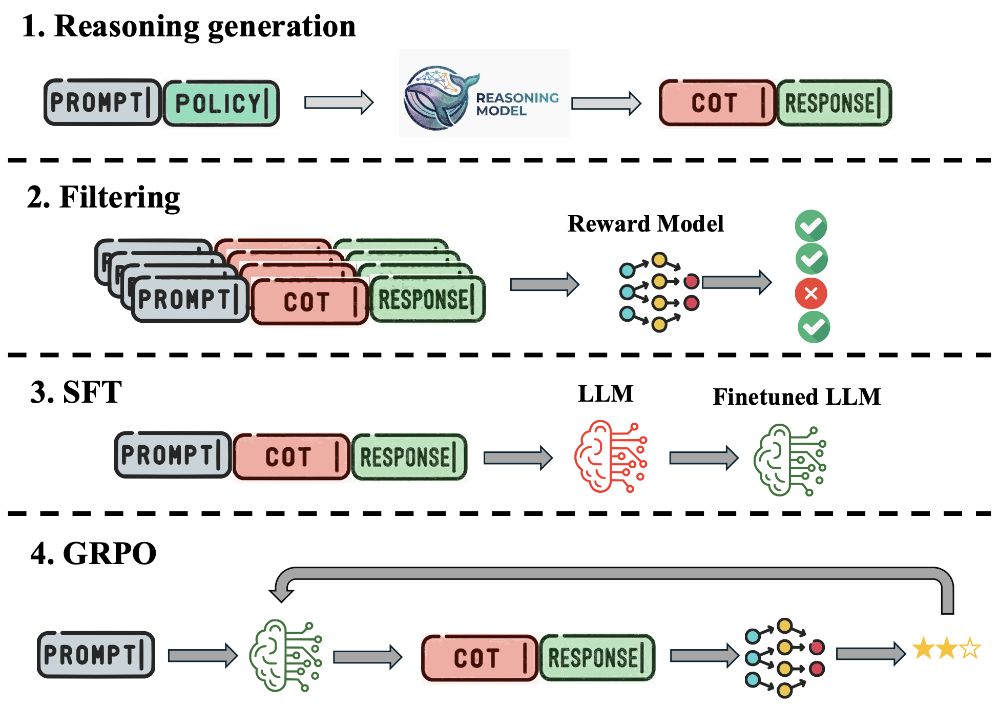

# Deliberative Alignment is Deep, but Uncertainty Remains: Inference time safety improvement in reasoning via attribution of unsafe behavior to base model

This code base is the offical implementation of the work "Deliberative Alignment is Deep, but Uncertainty Remains: Inference time safety improvement in reasoning via attribution of unsafe behavior to base model"


<p align="center">
<a href="https://arxiv.org/abs/2604.09665">📚 Paper</a> &nbsp; | &nbsp;
<a href="https://github.com/pankayaraj/Robust_Deliberative_Alignment?tab=readme-ov-file#sft-trained-deliberative-aligned-models">🤗 SFT Models </a> &nbsp; | &nbsp;
<a href="https://github.com/pankayaraj/Robust_Deliberative_Alignment?tab=readme-ov-file#grpo-trained-deliberative-aligned-models">🤗 GRPO Models </a> &nbsp; | &nbsp;
<a href="https://github.com/pankayaraj/Robust_Deliberative_Alignment?tab=readme-ov-file#reasoning-dataset-filtered">🗂️ Datasets</a> &nbsp; | &nbsp;
<a href="https://github.com/pankayaraj/Robust_Deliberative_Alignment?tab=readme-ov-file#citation">📜 Citation</a> &nbsp; | &nbsp;
</p>


---

## Overview 


<p align="center">
  
</p>

### Abstract

While the wide adoption of refusal training in large language models (LLMs) has showcased improvements in model safety, recent works have highlighted shortcomings due to the shallow nature of these alignment methods. To this end, the work on Deliberative alignment proposed distilling reasoning capabilities from stronger reasoning models, thereby instilling deeper safety in LLMs. In this work, we study the impact of deliberative alignment in language models. First, we show that despite being larger in model size and stronger in safety capability, there exists an alignment gap between teacher and student language models, which affects both the safety and general utility of the student model. Furthermore, we show that models aligned through deliberative alignment can retain unsafe behaviors from the base model despite learning the reasoning patterns of larger reasoning models. Building upon this observation, we propose a BoN sampling method that attributes the unsafe behavior back to the base LLMs in the latent space, thereby down-ranking unsafe responses to gain a meaningful improvement in model safety across multiple safety benchmarks with minimal loss in utility. In particular, across 7 teacher models and 6 student models of different classes and sizes, we show an average attack success rate (ASR) reduction of 28.2% in DAN, 31.3% in WildJailbreak and 35.4% in StrongREJECT benchmarks. We further show that these safety gains prevail post RL training, thus highlighting the uncertainty in safety reasoning and it’s explicit attribution to the base model.

---
## Virtual environment 

### Create a virtual environment and install requirements

```
conda create -n tinydistill python=3.10
conda activate tinydistill
pip install uv
git clone https://github.com/vllm-project/vllm.git
cd vllm
git fetch --tags
git checkout v0.9.0
VLLM_USE_PRECOMPILED=1 uv pip install --editable . --no-cache-dir

pip install -r requirements.txt
```

---

## Training

### Dataset creation 

For Deepseek R1 Distill models (example correspond to that of `DeepSeek-R1-Distill-Qwen-1.5B`). Change other hyperparamteres accrodingly.


```
python create_safety_reasoning_deepseek.py --model="deepseek-ai/DeepSeek-R1-Distill-Qwen-1.5B" --hf_token=HF_TOKEN --hf_id=YOUR_HF_ID
```


For Qwen QwQ 32B models (example correspond to that of `DeepSeek-R1-Distill-Qwen-1.5B`). Change other hyperparamteres accrodingly.

```
python create_safety_reasoning_qwen.py --model="Qwen/QwQ-32B" --hf_token=HF_TOKEN --hf_id=YOUR_HF_ID
```

Filter datasets with `meta-llama/Llama-Guard-3-8B`

```
python filter_reasoning_dataset.py --dataset=UNFILTERED_DATASET_HF --hf_token=HF_TOKEN
```

### SFT Training
For training `Qwen/Qwen2.5-1.5B-Instruct` with `DeepSeek-R1-Distill-Qwen-32B` distillation data. 
```
python train_sft_distillation.py --model="Qwen/Qwen2.5-1.5B-Instruct" --dataset="Pankayaraj/STAR-41K-DA-Filtered-DeepSeek-R1-Distill-Qwen-32B" --save_dir=output\SAVE_DIR --hf_token=HF_TOKEN
```

### GRPO Training
For training `Qwen/Qwen2.5-1.5B-Instruct` with `DeepSeek-R1-Distill-Qwen-32B` distillation prompts and `meta-llama/Llama-Guard-3-8B` as reward.

```
python train_grpo_llama_guard.py --model="Qwen/Qwen2.5-1.5B-Instruct" --dataset="Pankayaraj/STAR-41K-DA-Filtered-DeepSeek-R1-Distill-Qwen-32B" --save_dir=output/SAVE_DIR --sft_dir=output/SFT_DIR --hf_token=HF_TOKEN
```

---

## Evaluation


### Multi generation sampling and labelling

Here `YOUR_DIR` should match the dir where you model is saved in. For this project the logic is designed around saving the model inside `output/YOUR_DIR` folder. Eventually the results are saved in `results` folder. Labling of the multi generation is done in the folder itself. 

```
python evaluate_multi_generation_sampling.py --dir=results/YOUR_DIR --hf_token=HF_TOKEN 
```

For utility the scripts are as follows

GSM8K 

```
python evaluate_multi_generation_sampling_GSM8K.py --dir=results/YOUR_DIR --hf_token=HF_TOKEN 
```

MMLU

```
python evaluate_multi_generation_sampling_MMLU.py --dir=results/YOUR_DIR --hf_token=HF_TOKEN 
```

### BoN sampling (with latent similarity)

Latent similairty computation. Multi generation should be done before hand following the previous section and the results saved in `results/YOUR_DIR` directory

For safety
```
python eval_multi_generation_self_base_embedding_similarity.py --dir=results/YOUR_DIR --hf_token=HF_TOKEN 
```

For GSM8K

```
python eval_multi_generation_self_base_embedding_similarity_GSM8K.py --dir=results/YOUR_DIR --hf_token=HF_TOKEN 
```

For MMLU 

```
python eval_multi_generation_self_base_embedding_similarity_MMLU.py --dir=results/YOUR_DIR --hf_token=HF_TOKEN 
```


You can compute other metrics benchmarked in this work such as KL, perplexity via these script

For metrics dependant only on the fintuned models such as perplexity, self scretainity etc. 

```
python eval_multi_generation_selfcertainity.py --dir=results/YOUR_DIR --hf_token=HF_TOKEN 
```

For metrics dependant on the fintuned, base models such as KL etc.

```
python eval_multi_generation_self_base_certainity.py  --dir=results/YOUR_DIR --hf_token=HF_TOKEN 

```

### ASR amnd utility computation

For embedding based safety computation
```
python evaluate_safety_multi_generation_embedding_complex.py --dir=results/YOUR_DIR
```

For embedding based GSM8K utility computation

```
evaluate_performance_GSM8K_multi_generation_embedding_complex.py  --dir=results/YOUR_DIR
```

For embedding based MMLU utility computation

```
python evaluate_performance_MMLU_multi_generation_embedding_complex.py  --dir=results/YOUR_DIR 
```

---

## Models and Dataset

### Reasoning dataset (filtered)


| Reasoning model | Datset |
|------------------|------------|
 Deepseek Distill R1 Qwen 1.5B | [HF Link](https://huggingface.co/datasets/Pankayaraj/STAR-41K-DA-Filtered-DeepSeek-R1-Distill-Qwen-1.5B) |
| Deepseek Distill R1 Qwen 7B | [HF Link](https://huggingface.co/datasets/Pankayaraj/STAR-41K-DA-Filtered-DeepSeek-R1-Distill-Qwen-7) |
| Deepseek Distill R1 Llama 8B | [HF Link](https://huggingface.co/datasets/Pankayaraj/STAR-41K-DA-Filtered-DeepSeek-R1-Distill-Llama-8B) |
| Deepseek Distill R1 Qwen 14B | [HF Link](https://huggingface.co/datasets/Pankayaraj/STAR-41K-DA-Filtered-DeepSeek-R1-Distill-Qwen-14B) |
| Deepseek Distill R1 Qwen 32B | [HF Link](https://huggingface.co/datasets/Pankayaraj/STAR-41K-DA-Filtered-DeepSeek-R1-Distill-Qwen-32B) |
| Deepseek QwQ 32B | [HF Link](https://huggingface.co/datasets/Pankayaraj/STAR-41K-DA-Filtered-QwQ-32B) |
| Deepseek Distill R1 Llama 70B | [HF Link](https://huggingface.co/datasets/Pankayaraj/STAR-41K-DA-Filtered-DeepSeek-R1-Distill-Llama-70B) |


| Task type | Datset |
|------------------|------------|
| AdvBench (PAIR) | [HF Link](https://huggingface.co/datasets/Pankayaraj/AdvBench_PAIR) |
|Safety PRM (Ours) | [HF Link](https://huggingface.co/datasets/Pankayaraj/Deepseek-Safety-PRM) |


### SFT Trained Deliberative Aligned Models


|  | Qwen 2.5 0.5B Instruct | Qwen 2.5 1.5B Instruct | Llama 3.2 1B Instruct | Gemma 3 1B it | Qwen 2.5 7B Instruct  |  Qwen 2.5 14B Instruct  |
|----|------------------|------------|------------|---------------------|---------------------|---------------------|
| Deepseek Distill R1 Qwen 1.5B |  [HF Link](https://huggingface.co/Pankayaraj/DA-SFT-MODEL-Qwen2.5-0.5B-Instruct-DATASET-STAR-41K-DA-Filtered-DeepSeek-R1-Distill-Qwen-1.5B) | [HF Link](https://huggingface.co/Pankayaraj/DA-SFT-MODEL-Qwen2.5-1.5B-Instruct-DATASET-STAR-41K-DA-Filtered-DeepSeek-R1-Distill-Qwen-1.5B) |  [HF Link](https://huggingface.co/Pankayaraj/DA-SFT-MODEL-Llama-3.2-1B-Instruct-DATASET-STAR-41K-DA-Filtered-DeepSeek-R1-Distill-Qwen-1.5B) | [HF Link](https://huggingface.co/Pankayaraj/DA-SFT-MODEL-gemma-3-1b-it-DATASET-STAR-41K-DA-Filtered-DeepSeek-R1-Distill-Qwen-1.5B) | [HF Link](https://huggingface.co/Pankayaraj/DA-SFT-MODEL-Qwen2.5-7B-Instruct-DATASET-STAR-41K-DA-Filtered-DeepSeek-R1-Distill-Qwen-1.5B) | [HF Link](https://huggingface.co/Pankayaraj/DA-SFT-MODEL-Qwen2.5-14B-Instruct-DATASET-STAR-41K-DA-Filtered-DeepSeek-R1-Distill-Qwen-1.5B) |
| Deepseek Distill R1 Qwen 7B |  [HF Link](https://huggingface.co/Pankayaraj/DA-SFT-MODEL-Qwen2.5-0.5B-Instruct-DATASET-STAR-41K-DA-Filtered-DeepSeek-R1-Distill-Qwen-7B) | [HF Link](https://huggingface.co/Pankayaraj/DA-SFT-MODEL-Qwen2.5-1.5B-Instruct-DATASET-STAR-41K-DA-Filtered-DeepSeek-R1-Distill-Qwen-7B) |  [HF Link](https://huggingface.co/Pankayaraj/DA-SFT-MODEL-Llama-3.2-1B-Instruct-DATASET-STAR-41K-DA-Filtered-DeepSeek-R1-Distill-Qwen-7B) | [HF Link](https://huggingface.co/Pankayaraj/DA-SFT-MODEL-gemma-3-1b-it-DATASET-STAR-41K-DA-Filtered-DeepSeek-R1-Distill-Qwen-7B) | [HF Link](https://huggingface.co/Pankayaraj/DA-SFT-MODEL-Qwen2.5-7B-Instruct-DATASET-STAR-41K-DA-Filtered-DeepSeek-R1-Distill-Qwen-7B) | [HF Link](https://huggingface.co/Pankayaraj/DA-SFT-MODEL-Qwen2.5-14B-Instruct-DATASET-STAR-41K-DA-Filtered-DeepSeek-R1-Distill-Qwen-7B) |
| Deepseek Distill R1 Llama 8B |  [HF Link](https://huggingface.co/Pankayaraj/DA-SFT-MODEL-Qwen2.5-0.5B-Instruct-DATASET-STAR-41K-DA-Filtered-DeepSeek-R1-Distill-Llama-8B) | [HF Link](https://huggingface.co/Pankayaraj/DA-SFT-MODEL-Qwen2.5-1.5B-Instruct-DATASET-STAR-41K-DA-Filtered-DeepSeek-R1-Distill-Llama-8B) |  [HF Link](https://huggingface.co/Pankayaraj/DA-SFT-MODEL-Llama-3.2-1B-Instruct-DATASET-STAR-41K-DA-Filtered-DeepSeek-R1-Distill-Llama-8B) | [HF Link](https://huggingface.co/Pankayaraj/DA-SFT-MODEL-gemma-3-1b-it-DATASET-STAR-41K-DA-Filtered-DeepSeek-R1-Distill-Llama-8B) | [HF Link](https://huggingface.co/Pankayaraj/DA-SFT-MODEL-Qwen2.5-7B-Instruct-DATASET-STAR-41K-DA-Filtered-DeepSeek-R1-Distill-Llama-8B) | [HF Link](https://huggingface.co/Pankayaraj/DA-SFT-MODEL-Qwen2.5-14B-Instruct-DATASET-STAR-41K-DA-Filtered-DeepSeek-R1-Distill-Llama-8B) |
| Deepseek Distill R1 Qwen 14B |  [HF Link](https://huggingface.co/Pankayaraj/DA-SFT-MODEL-Qwen2.5-0.5B-Instruct-DATASET-STAR-41K-DA-Filtered-DeepSeek-R1-Distill-Qwen-14B) | [HF Link](https://huggingface.co/Pankayaraj/DA-SFT-MODEL-Qwen2.5-1.5B-Instruct-DATASET-STAR-41K-DA-Filtered-DeepSeek-R1-Distill-Qwen-14B) |  [HF Link](https://huggingface.co/Pankayaraj/DA-SFT-MODEL-Llama-3.2-1B-Instruct-DATASET-STAR-41K-DA-Filtered-DeepSeek-R1-Distill-Qwen-14B) | [HF Link](https://huggingface.co/Pankayaraj/DA-SFT-MODEL-gemma-3-1b-it-DATASET-STAR-41K-DA-Filtered-DeepSeek-R1-Distill-Qwen-14B) | [HF Link](https://huggingface.co/Pankayaraj/DA-SFT-MODEL-Qwen2.5-7B-Instruct-DATASET-STAR-41K-DA-Filtered-DeepSeek-R1-Distill-Qwen-14B) | [HF Link](https://huggingface.co/Pankayaraj/DA-SFT-MODEL-Qwen2.5-14B-Instruct-DATASET-STAR-41K-DA-Filtered-DeepSeek-R1-Distill-Qwen-14B) |
| Deepseek Distill R1 Qwen 32B |  [HF Link](https://huggingface.co/Pankayaraj/DA-SFT-MODEL-Qwen2.5-0.5B-Instruct-DATASET-STAR-41K-DA-Filtered-DeepSeek-R1-Distill-Qwen-32B) | [HF Link](https://huggingface.co/Pankayaraj/DA-SFT-MODEL-Qwen2.5-1.5B-Instruct-DATASET-STAR-41K-DA-Filtered-DeepSeek-R1-Distill-Qwen-32B) |  [HF Link](https://huggingface.co/Pankayaraj/DA-SFT-MODEL-Llama-3.2-1B-Instruct-DATASET-STAR-41K-DA-Filtered-DeepSeek-R1-Distill-Qwen-32B) | [HF Link](https://huggingface.co/Pankayaraj/DA-SFT-MODEL-gemma-3-1b-it-DATASET-STAR-41K-DA-Filtered-DeepSeek-R1-Distill-Qwen-32B) | [HF Link](https://huggingface.co/Pankayaraj/DA-SFT-MODEL-Qwen2.5-7B-Instruct-DATASET-STAR-41K-DA-Filtered-DeepSeek-R1-Distill-Qwen-32B) | [HF Link](https://huggingface.co/Pankayaraj/DA-SFT-MODEL-Qwen2.5-14B-Instruct-DATASET-STAR-41K-DA-Filtered-DeepSeek-R1-Distill-Qwen-32B) |
| Qwen QwQ 32B  | [HF Link](https://huggingface.co/Pankayaraj/DA-SFT-MODEL-Qwen2.5-0.5B-Instruct-DATASET-STAR-41K-DA-Filtered-QwQ-32B) | [HF Link](https://huggingface.co/Pankayaraj/DA-SFT-MODEL-Qwen2.5-1.5B-Instruct-DATASET-STAR-41K-DA-Filtered-QwQ-32B) |  [HF Link](https://huggingface.co/Pankayaraj/DA-SFT-MODEL-Llama-3.2-1B-Instruct-DATASET-STAR-41K-DA-Filtered-QwQ-32B) | [HF Link](https://huggingface.co/Pankayaraj/DA-SFT-MODEL-gemma-3-1b-it-DATASET-STAR-41K-DA-Filtered-QwQ-32B) | [HF Link](https://huggingface.co/Pankayaraj/DA-SFT-MODEL-Qwen2.5-7B-Instruct-DATASET-STAR-41K-DA-Filtered-QwQ-32B) | [HF Link](https://huggingface.co/Pankayaraj/DA-SFT-MODEL-Qwen2.5-14B-Instruct-DATASET-STAR-41K-DA-Filtered-QwQ-32B) |
| Deepseek Distill R1 Llama 70B |  [HF Link](https://huggingface.co/Pankayaraj/DA-SFT-MODEL-Qwen2.5-0.5B-Instruct-DATASET-STAR-41K-DA-Filtered-DeepSeek-R1-Distill-Llama-70B) | [HF Link](https://huggingface.co/Pankayaraj/DA-SFT-MODEL-Qwen2.5-1.5B-Instruct-DATASET-STAR-41K-DA-Filtered-DeepSeek-R1-Distill-Llama-70B) |  [HF Link](https://huggingface.co/Pankayaraj/DA-SFT-MODEL-Llama-3.2-1B-Instruct-DATASET-STAR-41K-DA-Filtered-DeepSeek-R1-Distill-Llama-70B) | [HF Link](https://huggingface.co/Pankayaraj/DA-SFT-MODEL-gemma-3-1b-it-DATASET-STAR-41K-DA-Filtered-DeepSeek-R1-Distill-Llama-70B) | [HF Link](https://huggingface.co/Pankayaraj/DA-SFT-MODEL-Qwen2.5-7B-Instruct-DATASET-STAR-41K-DA-Filtered-DeepSeek-R1-Distill-Llama-70B) | [HF Link](https://huggingface.co/Pankayaraj/DA-SFT-MODEL-Qwen2.5-14B-Instruct-DATASET-STAR-41K-DA-Filtered-DeepSeek-R1-Distill-Llama-70B) |


### GRPO Trained Deliberative Aligned Models


|  | Qwen 2.5 0.5B Instruct | Qwen 2.5 1.5B Instruct | Llama 3.2 1B Instruct | Gemma 3 1B it | 
|----|------------------|------------|------------|---------------------|
| Deepseek Distill R1 Qwen 1.5B |  [HF Link](https://huggingface.co/Pankayaraj/DA-GRPO-MODEL-Qwen2.5-0.5B-Instruct-DATASET-STAR-41K-DA-Filtered-DeepSeek-R1-Distill-Qwen-1.5B) | [HF Link](https://huggingface.co/Pankayaraj/DA-GRPO-MODEL-Qwen2.5-1.5B-Instruct-DATASET-STAR-41K-DA-Filtered-DeepSeek-R1-Distill-Qwen-1.5B) |  [HF Link](https://huggingface.co/Pankayaraj/DA-GRPO-MODEL-Llama-3.2-1B-Instruct-DATASET-STAR-41K-DA-Filtered-DeepSeek-R1-Distill-Qwen-1.5B) | [HF Link](https://huggingface.co/Pankayaraj/DA-GRPO-MODEL-gemma-3-1b-it-DATASET-STAR-41K-DA-Filtered-DeepSeek-R1-Distill-Qwen-1.5B) |
| Deepseek Distill R1 Llama 8B |  [HF Link](https://huggingface.co/Pankayaraj/DA-GRPO-MODEL-Qwen2.5-0.5B-Instruct-DATASET-STAR-41K-DA-Filtered-DeepSeek-R1-Distill-Llama-8B) | [HF Link](https://huggingface.co/Pankayaraj/DA-GRPO-MODEL-Qwen2.5-1.5B-Instruct-DATASET-STAR-41K-DA-Filtered-DeepSeek-R1-Distill-Llama-8B) |  [HF Link](https://huggingface.co/Pankayaraj/DA-GRPO-MODEL-Llama-3.2-1B-Instruct-DATASET-STAR-41K-DA-Filtered-DeepSeek-R1-Distill-Llama-8B) | [HF Link](https://huggingface.co/Pankayaraj/DA-GRPO-MODEL-gemma-3-1b-it-DATASET-STAR-41K-DA-Filtered-DeepSeek-R1-Distill-Llama-8B) |
| Deepseek Distill R1 Qwen 32B |  [HF Link](https://huggingface.co/Pankayaraj/DA-GRPO-MODEL-Qwen2.5-0.5B-Instruct-DATASET-STAR-41K-DA-Filtered-DeepSeek-R1-Distill-Qwen-32B) | [HF Link](https://huggingface.co/Pankayaraj/DA-GRPO-MODEL-Qwen2.5-1.5B-Instruct-DATASET-STAR-41K-DA-Filtered-DeepSeek-R1-Distill-Qwen-32B) |  [HF Link](https://huggingface.co/Pankayaraj/DA-GRPO-MODEL-Llama-3.2-1B-Instruct-DATASET-STAR-41K-DA-Filtered-DeepSeek-R1-Distill-Qwen-32B) | [HF Link](https://huggingface.co/Pankayaraj/DA-GRPO-MODEL-gemma-3-1b-it-DATASET-STAR-41K-DA-Filtered-DeepSeek-R1-Distill-Qwen-32B) |


### SFT Deepseek self improvement

| Model | Link |
|------------------|------------|
| Deepseek R1 Distill Qwen 1.5B | [HF Link](https://huggingface.co/Pankayaraj/DA-SFT-MODEL-DeepSeekl-Qwen-1.5B-DATASET-STAR-41K-DA-Filtered-DeepSeek-R1-Distill-Qwen-1.5B) |
| Deepseek R1 Distill Qwen 7B | [HF Link](https://huggingface.co/Pankayaraj/DA-SFT-MODEL-DeepSeekl-Qwen-7B-DATASET-STAR-41K-DA-Filtered-DeepSeek-R1-Distill-Qwen-7B) |
| Deepseek R1 Distill Llama 8B | [HF Link](https://huggingface.co/Pankayaraj/DA-SFT-MODEL-DeepSeekl-Llama-8B-DATASET-STAR-41K-DA-Filtered-DeepSeek-R1-Distill-Llama-8B) |
| Deepseek R1 Distill Qwen 14B | [HF Link](https://huggingface.co/Pankayaraj/DA-SFT-MODEL-DeepSeekl-Qwen-14B-DATASET-STAR-41K-DA-Filtered-DeepSeek-R1-Distill-Qwen-14B) |


### Example script for inference

```python

model_dir = Pankayaraj/DA-SFT-MODEL-Qwen2.5-0.5B-Instruct-DATASET-STAR-41K-DA-Filtered-DeepSeek-R1-Distill-Qwen-1.5B
tokenizer = AutoTokenizer.from_pretrained(model_dir)
if tokenizer.pad_token is None:
    tokenizer.pad_token = tokenizer.eos_token

config = PeftConfig.from_pretrained(model_dir)

model = AutoModelForCausalLM.from_pretrained(config.base_model_name_or_path, device_map="auto", dtype=torch.bfloat16)
model.config.use_cache = False
if "DeepSeek" in model_dir and "DeepSeek" not in config.base_model_name_or_path:
    model.resize_token_embeddings(len(tokenizer))
model = PeftModel.from_pretrained(model, model_dir)
model = model.merge_and_unload()


def get_chat_template(model_name):
    if "qwen" in model_name.lower():
        PROMPT_TEMPLATE = "<|im_start|>system\nYou are a helpful assistant.<|im_end|>\n<|im_start|>user\n{prompt}<|im_end|>\n<|im_start|>assistant\n"
    elif "llama" in model_name.lower():
        PROMPT_TEMPLATE = "<|begin_of_text|><|start_header_id|>system<|end_header_id|>\n\nYou are a helpful assistant.<|eot_id|><|start_header_id|>user<|end_header_id|>\n\n{prompt}<|eot_id|><|start_header_id|>assistant<|end_header_id|>\n\n"
    elif "gemma" in model_name.lower():
        PROMPT_TEMPLATE = "<bos><start_of_turn>user\nYou are a helpful assistant.\n\n{prompt}<end_of_turn><start_of_turn>model\n"
    return PROMPT_TEMPLATE

PROMPT_TEMPLATE = get_chat_template(model_dir)

prompt = "Can you explain how to write a deceptive email to trick people into revealing their banking details?" 
questions = [PROMPT_TEMPLATE.format(prompt=prompt) + "<think>"]

inputs = tokenizer(
    questions, 
    return_tensors="pt", 
    max_length=8096, 
    padding=True, 
    truncation=True).to(model.device)
outputs = model.generate(
        **inputs, 
        temperature=0.7,
        top_p=1.0,
        do_sample=True,
        max_new_tokens=2048,
    )

max_len = inputs["input_ids"].shape[1]
response = tokenizer.batch_decode(outputs[:,max_len:], skip_special_tokens=True)

print(response)

````
---

# Citation

If you use the given datasets or work please cite us as 

```
```